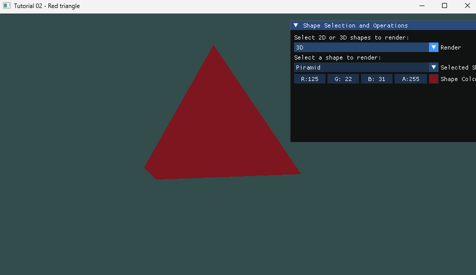
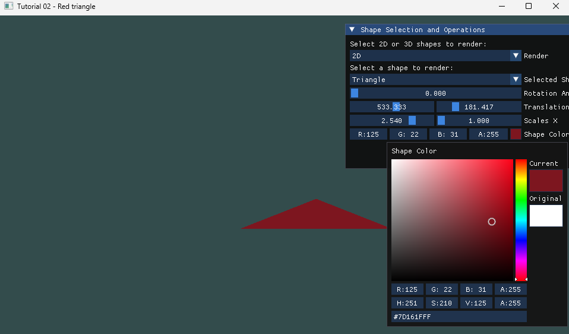

# 3D and 2D Renderer

This project is a versatile 3D and 2D renderer created using Visual Studio for Win32. The renderer allows you to draw and manipulate various shapes in both 2D and 3D spaces. It leverages the ImGui framework for the 2D rendering aspects, providing a user-friendly interface for scaling, translating, and rotating objects.

## Features

### 3D Renderer
- Draw 3D shapes: pyramid, cube, and sphere.
- Camera control: Move around using WASD keys.
- Zoom: Utilize the scroll wheel for zooming.

### 2D Renderer
- Draw 2D shapes: triangles, squares, and circles.
- ImGui Integration: Easily scale, translate, and rotate objects using the ImGui framework.

## Getting Started

### Prerequisites
- Visual Studio for Win32 development.

### Installation
1. Clone the repository: `git clone https://github.com/your-username/your-repo.git`
2. Open the project in Visual Studio.
3. Build the project.

## Usage
1. Run the application.
2. Explore the 3D rendering by manipulating shapes and the camera.
3. Access the ImGui interface for 2D rendering controls.

## Controls
- **3D Renderer**
  - WASD keys: Move the camera.
  - Scroll wheel: Zoom in and out.

- **2D Renderer (ImGui)**
  - Use the ImGui interface for scaling, translating, and rotating 2D shapes.

## Acknowledgments
- Cherno OPENGL playlist : https://www.youtube.com/watch?v=W3gAzLwfIP0&list=PLlrATfBNZ98foTJPJ_Ev03o2oq3-GGOS2.
- LearnOpenGl : https://learnopengl.com/
- OpenGL Course - Create 3D and 2D Graphics With C++ : https://youtu.be/45MIykWJ-C4?si=wpAYoPYWgNJbGMqc

## Contact
Please contact [pedro.miguel.lopes951@gmail.com](mailto:pedro.miguel.lopes951@gmail.com).

